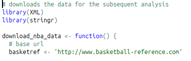
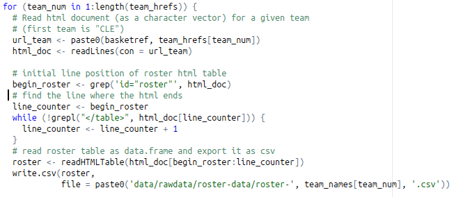
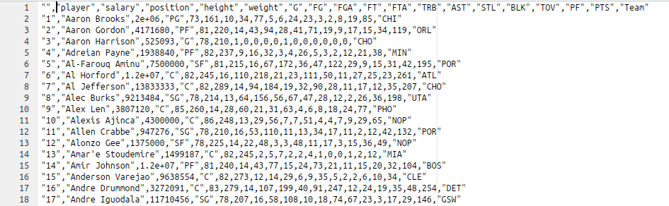
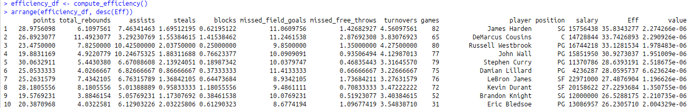

```{r setup, include=FALSE}
knitr::opts_chunk$set(echo = TRUE)
```

```{r, include=FALSE}
library(ggplot2)
library(shiny)
library(dplyr)
library(plyr)
source(file = "code/scripts/rmd_helpers.R")
```

##Stats 133 Final Project
Girish Balaji, Yian Liou, Rachel Lee, Canishka De Silva

###Abstract
This project aims to analyze data about basketball players from the National Basketball Association (NBA) League in the 2015-2016 season, in order to answer, “In the 2015-2016 season, how do the skills of a player relate to his salary?” With three kinds of raw data tables -- roster, totals, and salaries -- we conducted an analysis on the correlation between the players’ performance, which was measured by the EFF (efficiency index), and their respective salaries. Based on this analysis, the correlation coefficient resulted to be 0.6721, which shows a relatively strong, positive relationship between the players’ performance and salary. 

```{r}
#Efficiency corresponds to 10 (please refer to rmd_helper code for details)
x_statistic = 10
#Salary corresponds to 11 (please refer to rmd_helper code for details)
y_statistic = 11
plot_salary_stat_graph(x_statistic, y_statistic)
```

###Introduction
Through analyzing the available NBA data sets which included three kinds of raw data tables -- roster, totals, and salaries -- and performing a global analysis targeting 1) salaries aggregated by team, 2) performance of players, 3) correlations between salary and skills, and 4) value of a player, we were assigned to answer the question, “In the 2015-2016 season, how do the skills of a player relate to his salary?”

There were some exploratory research questions* throughout the analysis which needed to be answered in order to perform a consistent analysis: 
1) How can we evaluate the performance of the players? 
2) Which skills are more correlated with salary? 
3) Are there any differences in skills and salary depending on the player’s position? 
4) Are the players really worth the amount of money clubs pay for? 
5) Are there any undervalued or overvalued players? 

*These questions will be answered in the results section of this report.
Data
Describe the sources of data. This implies briefly talking about Basketball Reference, as well as the used tables. What is the NBA? What is the data’s season? How many basketball teams in the NBA? What is the format of the data tables? ETC 

In terms of the sources of the data, the NBA is the National Basketball Association, a men’s professional basketball league in America with 30 teams -- 29 teams in the US and 1 team in Canada, founded in New York City in 1946. The data refers to the 2015-2016 season. The data tables that were used in the analysis to answer the question, “In the 2015-2016 season, how do the skills of a player relate to his salary?” was in HTML format. The data tables included data relating to three aspects: roster, totals, and salaries. There were many more data tables, however, only the required tables were acquired for the purpose of our analysis.


###Methodology
The cleaning and basic analytics process basically comprised of scraping the data off the NBA basketball-reference.com website. Due to complications in the scraping discussed during the discussion, we were provided the code to actually scrape the necessary data from the tables given a list of all the teams to analyze. We simply iterated over the list of teams we had to analyze and scraped the data of its associating URL and and loaded the data into the raw_data folder. Once, we completed scraping all the data the salary, roster, and stats data we needed and placed them into their respective folders, we proceeded to analyze and clean the data. 

- This function actually extracts the data from the site below



- Part of the function sampling how we load roster data



To clean the data, we used the list of all teams that we had originally, extracted the roster, salary, and stats data, created a data frame for that particular team that merged all three respective csv files, and ultimately merged all the team data frames into a massive data frame for all the players in the NBA. As was instructed by the course staff, we removed all players with duplicate instances in the final NBA dataframe which brought the 491 players to 447 players excluding those duplicated; there were around 470 unique players. Once we acquired the final data frame for analysis organized by the names of all the players, we simply did some final cleaning of the data: we converted all the dates to Date objects, converted all numeric columns to numerics, renamed all the columns as per course staff instructions to be extra clear, and checked for missing values. 

- This is the raw_data we have loaded into the CSVs


- This is our final output after hard cleaning work


 
Once the cleaned data table is obtained,we computed summary statistics for each variable and sank that into a text file. At the same time, histograms, boxplots, and bar-charts were created respectively for each variable, and the images of the graphs are saved in the images folder. Afterwards, we used dplyr to group the player’s salaries by team, which were used for the team-salaries csv and its respective shiny app.

To understand the value of each player, we proceeded to find a standardized efficiency index for each person given their respective positions. We created a new table with the variables of name, rebounds, steals, missed field goals, turnovers, efficiency index, points, assists, blocks, missed free throws, games played,salary, and value. The standardized efficiency index was basically calculated by standardizing all the values of the 8 statistics columns among those listed above, then using Principal Component Analysis to separate the data to maximize variation and we used the first principal component weights for each statistic divided by their corresponding standard deviations projected onto each player’s personal statistics to get their own efficiency index. With this data, we were able to judge each player's’ effectiveness in their respective positions.
ere taken into account


- Our final PCA efficiencies! We know the best players!



From this table, we were able to create the second shiny app to display the correlation between a certain characteristic and the respectively salary, and calculate the best 20 valued players and worst 20 valued players.

Using the CSV files (eff_salary_stats.csv and team-salaries.csv) that were produced after cleaning and analysing the raw data files, we created two shiny apps to visualize the results that we acquired.
            Stat-Salaries: https://canishka.shinyapps.io/stat-salaries/
            Team-Salaries: https://canishka.shinyapps.io/team-salaries/

Stat-Salaries
Reads in the eff_salary_stats.csv and allows the user to input the required statistics to be compared. This app can be used to find the relationship between salary and the computed efficiency index as well as all other statistics relating to the player. Furthermore the user may also opt to sort the plot according to positions of the players which gives us additional information from the data. Finally, this app also provides the user with the correlation coefficient of the statistics being compared, and assists the user in finding correlations if there is one. 
Team-Salaries
Reads in the team-salaries.csv and allows the user to input the required statistic to be visualised for the team. This app can be used to visualise the overall salary statistics per team and the user has the option of ordering by ascension or descension. 
Once the apps were completed we deployed the apps onto the shinyapps hosting platform, where users can access them remotely to conduct any analysis of the gathered data. 

###Results
What are the main results? Is there anything interesting? Did you find any surprises? What patterns did you identify? Do the results make sense? Insights?
- to compensate for drawbacks in EFF, different efficiency indices of the players' positions w

Based on our analysis using the players’ EFF and salaries, the main results of this project indicated that with a relatively strong, positive correlation coefficient of 0.6721, the player’s performance and their respective salaries were positive correlated. Although there were a few exceptions with a relatively high performance and low pay, or low performance and high pay, most points adhered to the regression line. 

We were also able to identify the 20 best valued players and the 20 worst valued players, which was computed with respect to the EFF and salary of the players. This list can be accessed in the best-worse-value-players.txt file. 


Let's try to visualize the different distributions in value regarding each of the positions.
```{r}
player_stats_csv = read.csv('data/cleandata/eff_salary_stats.csv')
ggplot(player_stats_csv, aes(factor(position), value)) +
  geom_boxplot() + coord_flip() + xlab("") + ylab("Value") + ggtitle("Value by Position")
```

As we can see above, there are several outliers for each position. The major outlier thhat we see for the shooting forward is Dahntay Jones. 

```{r}
player_stats_csv = read.csv('data/cleandata/eff_salary_stats.csv')
print("Most Value Players")
head(arrange(player_stats_csv, desc(value)), 5)
```
From looking at the top 5 most value, we can easily see that these players are not necessarily particularly great relative to the best in the NBA; but, rather, these players are instead performing decently with a marginal, almost trivial salary. 

Another interesting insight based on the EFF to salary plot was that there was a higher concentration of players who performed worse and got paid less, compared to the players who performed well and got paid higher. Although the regression line clearly showed a positive correlation relationship, more than half of the points in the plot were concentrated in the bottom left quadrant of the plot -- where lower paid and worse performing players would be plotted.

We were also able to answer the exploratory research questions as below: 

1) How can we evaluate the performance of the players? 
The performance of the players was evaluated by the EFF (efficiency index), which was computed using total points, total rebounds, assists, steals, blocks, missed field goals, missed free throws, turnovers, and games played. Then, we compared the EFF with the salary to see the correlation between the players’ performance and their respective salaries. 
```{r}
is_outlier <- function(x) {
  return(x < quantile(x, 0.25) - 1.5 * IQR(x) | x > quantile(x, 0.75) + 1.5 * IQR(x))
}

player_stats_csv = read.csv('data/cleandata/eff_salary_stats.csv')

player_stats_csv %>%
  group_by(factor(position)) %>%
  mutate(outlier = ifelse(is_outlier(Eff), as.character(player), as.character(NA))) %>%
  ggplot(., aes(x = factor(position), y = Eff)) +
    geom_boxplot() +
    geom_text(aes(label = outlier), na.rm = TRUE, hjust = -.05)
```
With this above chart we can easily see the best players for every position. I wrote a function to display the names of all the outliers for every position; from the data we see that DeMarcus Cousins, Davis, James, and Harden, are the best (and greatest positive outliers) for their particular position. As we don't have any explicit outliers for point guards, let's just try to see the names of the top (most efficient NBA players).

```{r}

print("Most Efficient Players - Best in the NBA")
head(arrange(player_stats_csv, desc(Eff)), 5)
```
With this metric, we can see that various point guards are among the most effective players in the league: Westbrook, Wall, and Curry.

2) Which skills are more correlated with salary? 
In order to take into consideration the different correlation of skills with salary, we implemented different weights for each skills to calculate the EFF. Through analyzing different X-axis statistics with the Y-axis statistic being “salary”, “total points” had the highest correlation with salary. This was an interesting result, which could potentially emphasize the claim that offense players usually get paid higher than defense players because of the nature of their expertise and performance in the game with respect to the number of points.

```{r}
print("Offensive Correlation Salary Analysis")
plot_salary_stat_graph(1, 11)
plot_salary_stat_graph(3, 11)
print("Defensive Correlation Salary Analysis")
plot_salary_stat_graph(4, 11)
plot_salary_stat_graph(5, 11)

```

As our graphs clearly show, their is a much greater correlation between salary with the offensive metrics than the defensive metrics.

3) Are there any differences in skills and salary depending on the player’s position? 
Based on the EFF Index to Salary plot, there is no distinct pattern in the skills and salary correlation depending on the players’ positions. The colors of the dots seem to be evenly distributed across the plot, indicating a lack of a distinct pattern of certain positions being better correlated than others. 
```{r}

plot_salary_stat_graph(10, 11) +
    facet_grid(. ~ position)
df <- player_stats_csv
df$x = df$Eff
df$y = df$salary

lm_eqn = function(df){
    m = lm(y ~ x, df);
    eq <- substitute(italic(y) == a + b %.% italic(x)*","~~italic(r)^2~"="~r2, 
         list(a = format(coef(m)[1], digits = 2), 
              b = format(coef(m)[2], digits = 2), 
             r2 = format(summary(m)$r.squared, digits = 3)))
    as.character(as.expression(eq));                 
}
df$group = df$position
eq <- ddply(df,.(group),lm_eqn)
p <- ggplot(data = df, aes(x = x, y = y)) +
            geom_smooth(method = "lm", se=FALSE, color="black", formula = y ~ x) +
            geom_point()
p1 = p + geom_text(data=eq,aes(x = 25, y = 300,label=V1), parse = TRUE, inherit.aes=FALSE) +          facet_grid(group ~ .) +
    xlab("EFF") + ylab("SALARY")
p1 

```

With this analysis, we can clearly see tht power forwards have the strongest correlation between their efficiency on the court and their actual pay, whereas centers' pay do not necessarily follow from their efficiency on the court. We can clearly see the regression lines for each position. 

4) Are the players really worth the amount of money clubs pay for? 
If we define players being “really worth the amount of money clubs pay for” as high pay for high performance and low pay for low performance, then the relatively strong, positive correlation coefficient of 0.6721 would indicate that players are really worth the amount of money clubs pay for. However, there are definitely exceptions as there are players who get paid less than those who perform worse, and players who get paid more than those who perform better. 

5) Are there any undervalued or overvalued players? 
The EFF Index to Salary plot displays a number of points which deviate from the regression line, which shows a positive correlation. For instance, there are certain points (players) who receive a lower salary than another player who has a lower EFF (player performance). If all the points were to adhere to the regression line, every player who performs better, which is indicated by the EFF, should earn more than every player who performs worse.

We can use the regression line model to see all the players who are underpaid and overpaid for each position. For each position, each player that is above the line is overpaid whereas all players below the line are underpaid given their efficiency.

###Conclusions
Summarize the main results of the analysis. Who could benefit from your analysis? Based on your results, what other questions and/or hypotheses can you come up with? What other future analyses would you like to perform (time permitting)? Make relevant conclusions explicitly connected to the analysis and context. 

Through analyzing and identifying the correlation between the players’ EFF and salaries, this project indicated that there was a relatively strong, positive correlation coefficient of 0.6721. Although there were a few exceptions with a relatively high performance and low pay, or low performance and high pay, most points adhered to the regression line. 

To put this into real-life application, this analysis could benefit general managers because the best valued players would serve as a benchmark to evaluate other player’s values. For instance, because Dahntay Jones is the best valued player, any player with the same EFF but with a lower pay than $1,551,659 (http://www.espn.com/nba/player/_/id/2008/dahntay-jones). Thus, theoretically, players with the same EFF, but with a higher pay, should not have their contracts extended, and thus be traded in terms of the teams’ budgets and return of investment.

One of the considerations with this analysis relates to the number of minutes played for each player. For instance, a player who plays fewer minutes per game will more easily achieve a higher efficiency because factors such as mental and physical exhaustion don’t come into play as much. High-caliber players, however, play a higher number of minutes per game, and thus experience diminishing marginal production per extra minute played, as fatigue becomes more of a factor. For example, a player who attempts a 3-point field goal has a higher chance of making the shot when he is feeling fresh at the start of the game, as opposed to when he is feeling winded after having played 30+ minutes. To better illustrate this point, we can observe the rebounding numbers of Utah Jazz forward Derrick Favors from 2011 to 2016.

Derrick Favors 2011-2013 Seasons
Minutes per game: 22.25
Rebounds per game: 6.8
Rebounds per minute: 0.305

In the following 3 seasons, Derrick Favors minutes’ per game increased to 31 minutes. Based on his rebound-per-minute rate of 0.305 from the 2011-2013 seasons, we would expect to see Favors grab 9.47 rebounds per game. His rebounding numbers, however, did not meet those expectations.

Derrick Favors 2013-2016 Seasons
Minutes per game: 31.0
Rebounds per game: 8.3
Rebounds per minute: 0.268

We can clearly see that Favors’ rebounds increased at a diminishing rate, as an increased workload resulted in a dip in his per-minute production.

Based on our results, we should further analyze the correlation between the rankings of the teams and their ownership high or low-valued players (value, here, being the correlation between the EFF and salaries of players). This information could indicate if teams who perform well efficiently use their budget in paying their players, and which players should keep in order to rise up in their rankings. This information could also be accompanied by the team’s willingness to pay for players.  

Another future consideration, a more realistic approach to this data analysis would potentially point out the best performing player with the lowest pay, which would be the most wanted player for the general managers, who make decisions for the teams. 


