Stats 133 - Final Project Slides
========================================================
author: Rachel Lee, Canishka de Silva, Yian Liou, Girish Balaji
date: December 2, 2016
autosize: true

Introduction
========================================================

**Purpose:**  
Through analysis of NBA data sets from 2015 - 2016, we answered the question, "*In the 2015-2016 season, how do the skills of a player relate to this salary?*"

Process One | Scraping
========================================================
- scraping data off NBA basetball-reference.com website to better categorize data
- Below are samples of web data input and how we loaded it 
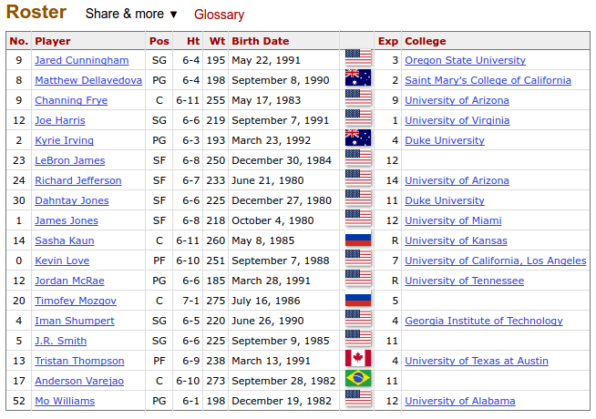

Process One Continued | Scraping
========================================================
- This function actually extracts the data from the site below
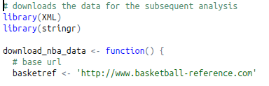
- Part of the function sampling how we load roster data
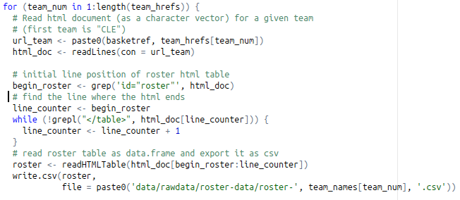

Process One Continued | Cleaning
========================================================
- This is the raw_data we have loaded into the CSVs
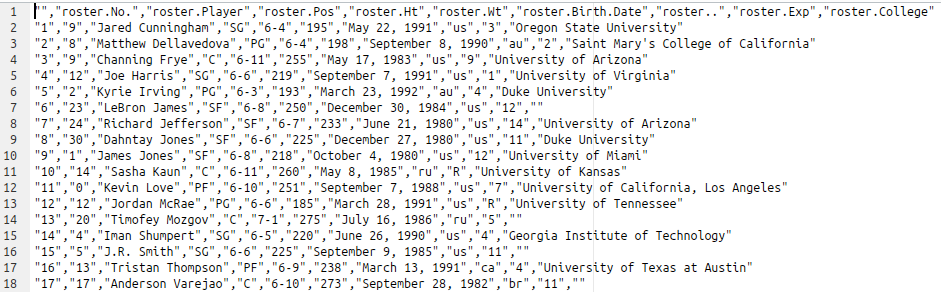
- This is our final output after hard cleaning work
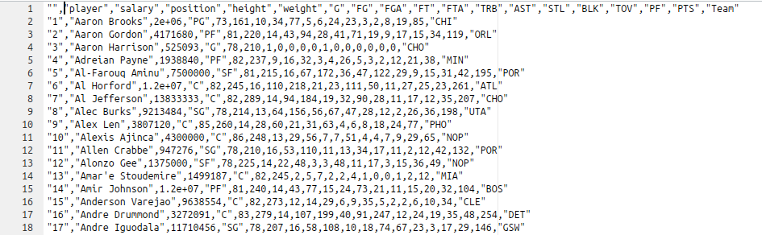

Process Two | Exploratory Data Analysis
========================================================

- analysis of variables to calculate descriptive summaries for quantitative variables 

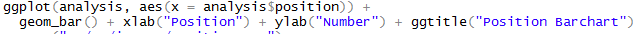
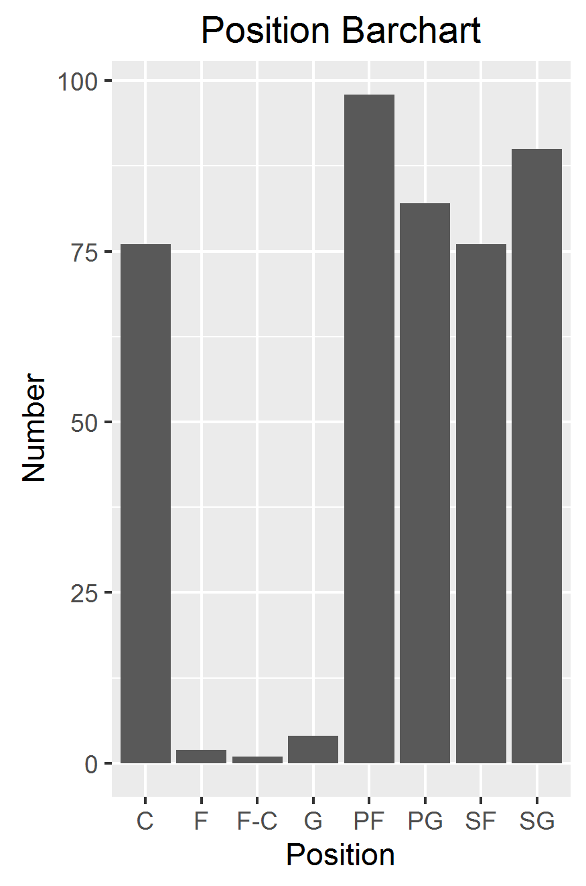

========================================================
Process Two | Exploratory Data Analysis Continued
- Analysis of variables to Calculate descriptive summaries for quantitative variables
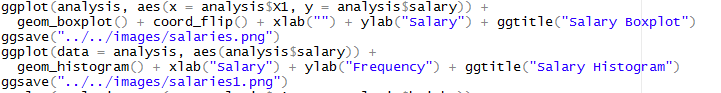
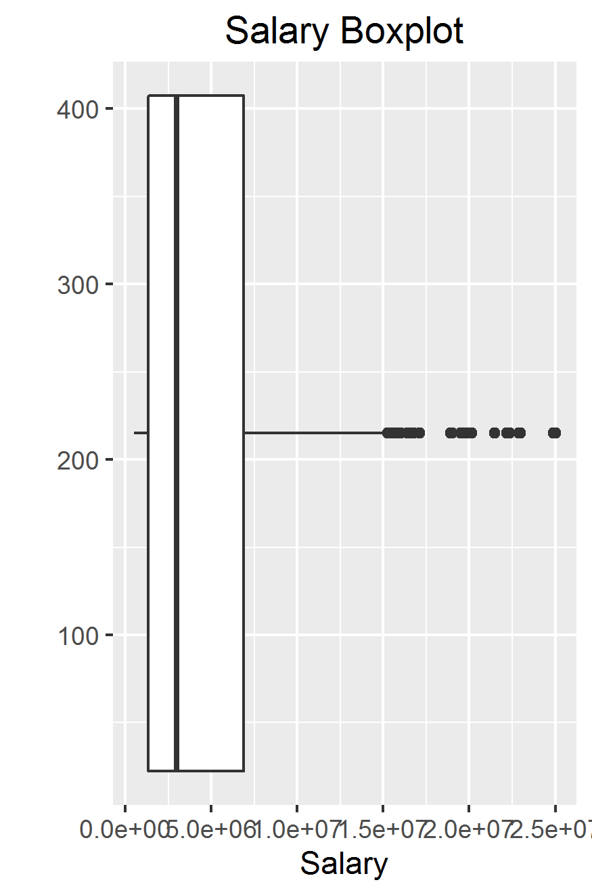
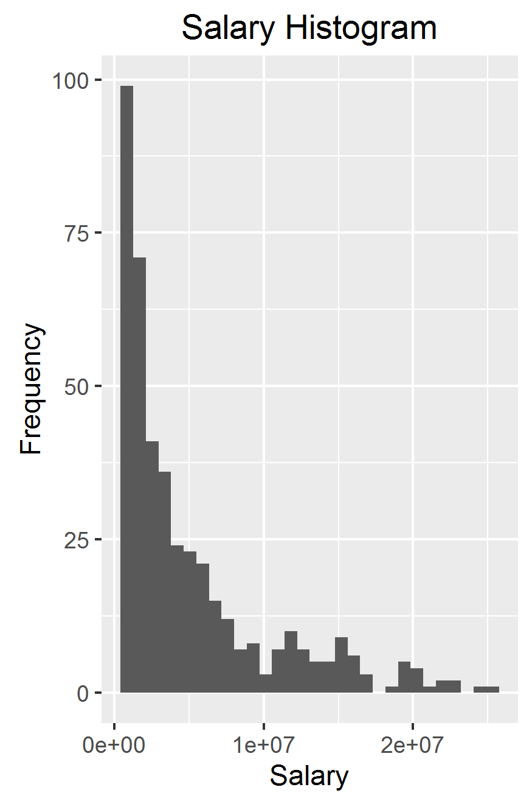

Process Three | Principal Components Analysis
========================================================

- to compensate for drawbacks in EFF, different efficiency indices of the players' positions were taken into account
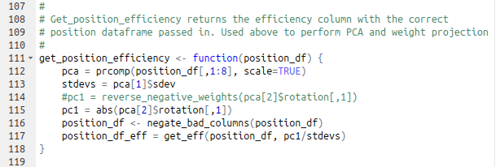
- Our final PCA efficiencies! We know the best players!
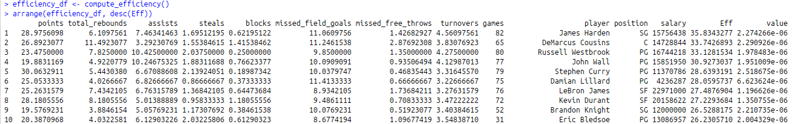

Shiny App 
========================================================

- visualization of the relationship between player statistics including different statistics
- main statistical analysis: salary and EFF 
- correlation coefficient: 0.6721

Shiny App (Continued)
========================================================
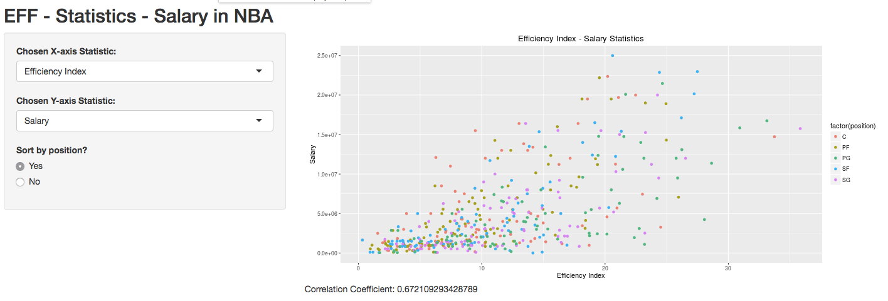

Main Takeaways
========================================================

- coefficient correlation: 0.6721
- meaning: the player’s performance and their respective salaries were positive correlated
- 20 best valued players and 20 worst valued players were also analyzed as below:

[1] "best Valued players"
 [1] "Dahntay Jones"      "Jordan Hamilton"    "Jared Cunningham"   "Xavier Munford"     "Chuck Hayes"       
 [6] "Jordan Farmar"      "Henry Sims"         "Elliot Williams"    "Lorenzo Brown"      "Alan Williams"     
[11] "Michael Beasley"    "Nate Robinson"      "Axel Toupane"       "Bryce Dejean-Jones" "Justin Harper"     
[16] "Coty Clarke"        "Andrew Goudelock"   "T.J. McConnell"     "Jordan Clarkson"    "Duje Dukan"        
[1] "worst valued players"
 [1] "Amir Johnson"      "LaMarcus Aldridge" "Kirk Hinrich"      "Andre Iguodala"    "Dwight Howard"    
 [6] "Tyson Chandler"    "Chris Bosh"        "Andrew Bogut"      "Wesley Matthews"   "Kobe Bryant"      
[11] "Enes Kanter"       "Tiago Splitter"    "Chris Kaman"       "Tristan Thompson"  "Kevin Garnett"    
[16] "Omer Asik"         "Joel Anthony"      "Roy Hibbert"       "Nikola Pekovic"    "Sam Dekker"     
